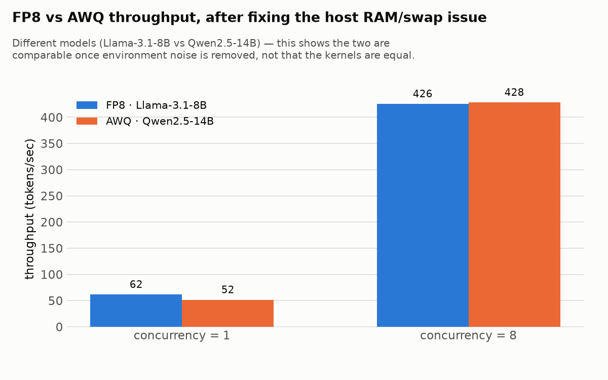
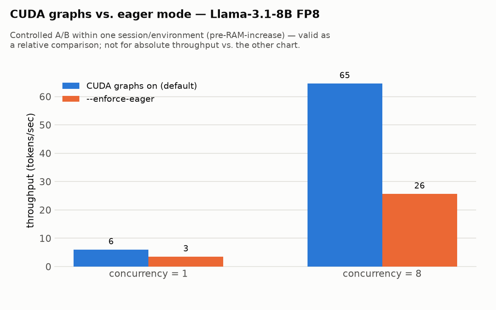
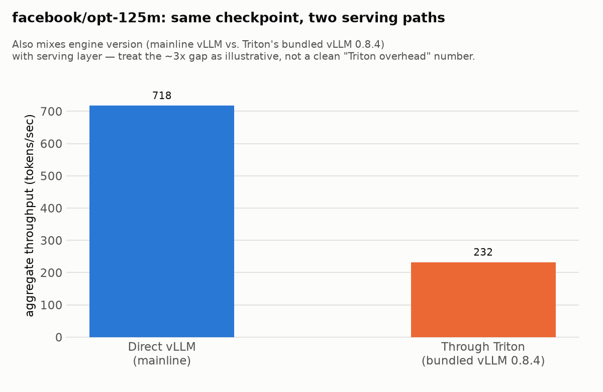

# vLLM Quantization & Serving Benchmarks

Hands-on benchmarking of vLLM serving configurations on a single consumer-grade
16GB GPU (RTX 4080 SUPER), comparing quantization methods (FP8 vs. AWQ) and
serving layers (vLLM directly vs. NVIDIA Triton Inference Server's vLLM
backend), with a full observability stack (Prometheus + Grafana + DCGM) and
MLflow experiment tracking.

This isn't a polished benchmark suite — it's a working log of real debugging,
including dead ends, corrected conclusions, and a couple of genuine upstream
bugs. That's deliberate: the methodology and the mistakes are as much the
point as the numbers.

## Stack

- **vLLM** (`vllm/vllm-openai:latest`) — one model server container at a time,
  since everything here targets a single 16GB GPU.
- **Prometheus + Grafana + DCGM exporter** — GPU and request-level metrics,
  via `docker-compose.yml`.
- **MLflow** — every benchmark run (model, quantization, concurrency, latency,
  throughput) is logged as a run under the `vllm-model-comparison` experiment,
  backed by a local SQLite store (`mlflow-data/mlflow.db`, included).
- **NVIDIA Triton Inference Server** (vLLM backend) — a second serving path,
  run standalone via `docker run` (not part of the compose stack, since it
  competes for the same GPU).

## Layout

```
docker-compose.yml            # prometheus, grafana, dcgm-exporter, mlflow
run-mistral-fp8.sh             # Mistral-7B-Instruct-v0.3, on-the-fly FP8
run-llama3.1-8b-fp8.sh         # Llama-3.1-8B-Instruct, on-the-fly FP8 (gated, needs HF_TOKEN)
run-qwen2.5-14b-awq.sh         # Qwen2.5-14B-Instruct-AWQ, pre-quantized 4-bit
log_experiment.py              # benchmark client for vLLM's OpenAI-compatible API
log_experiment_triton.py       # benchmark client for Triton's gRPC streaming API
triton_client_test.py          # minimal single-request smoke test against Triton
triton-model-repository/       # Triton model repo: facebook/opt-125m via vLLM backend
triton-model-repository-llama/ # Triton model repo: Llama-3.1-8B via vLLM backend
prometheus/prometheus.yml      # scrape config (vllm, dcgm, triton jobs)
grafana/                       # dashboard/datasource provisioning (not yet wired into compose)
grafana.json                   # vLLM's official Grafana dashboard export
grafana-triton-dashboard.json  # community Triton Grafana dashboard (grafana.com #18737)
mlflow-data/mlflow.db          # all benchmark run data logged this session
charts/                        # static PNG exports of the key MLflow comparisons (see Findings)
```

`.env` (not included — see `.gitignore`) holds `HF_TOKEN` for gated model
downloads (Llama).

## Running it

```bash
docker compose up -d                 # prometheus, grafana, dcgm-exporter, mlflow
./run-mistral-fp8.sh                 # or run-llama3.1-8b-fp8.sh / run-qwen2.5-14b-awq.sh
```

Benchmark client runs in a throwaway container on the compose network (the
host's system Python is externally-managed and has no working `venv`):

```bash
docker run --rm --network vllm_default --add-host=host.docker.internal:host-gateway \
  -v "$PWD":/app -w /app -v vllm-pip-cache:/root/.cache/pip \
  python:3.11-slim bash -c "pip install -q mlflow requests && \
    python log_experiment.py --model <hf-model-id> --quantization <fp8|awq|none> \
      --run-name <name> --num-requests 16 --concurrency 8"
```

Results land in MLflow at `http://localhost:5000`, dashboards in Grafana at
`http://localhost:3000` (admin/admin).

## Findings

**1. Quantization changes what fits, not just how fast it runs.** None of the
three base models used here fit on this 16GB card in bf16 — confirmed
empirically, not just calculated: Mistral-7B bf16 (~14GB weights) leaves
*negative* headroom for a KV cache even at the maximum safe
`gpu_memory_utilization`; Llama-3.1-8B bf16 (~15GB weights) exceeds free VRAM
before the KV cache is even considered; Qwen2.5-14B dense bf16 (~29GB) exceeds
the card's total capacity outright. Quantization here is the difference
between running and not running, not an optimization on top of a working
setup.

**2. A measurement artifact can fully invert a quantization comparison —
which is exactly what happened here.** The first pass measured on-the-fly FP8
(Llama-3.1-8B) at batch size 1 as ~9x slower than AWQ/Marlin (Qwen2.5-14B), and
concluded FP8's kernel was intrinsically inefficient at low batch sizes. That
conclusion does not survive a controlled re-test. The box was running with
7.8GB of system RAM and swapping under load; once RAM was increased to 31GB,
the *identical* FP8 config reached ~62 tok/s at batch size 1 — slightly
*ahead* of AWQ's ~52 tok/s, on a smaller model no less — and at concurrency=8
the two are statistically the same (~426 vs. ~428 tok/s):



The real lesson isn't about FP8-vs-AWQ kernel design at all: it's that a
resource-starved host can produce a completely convincing, internally
consistent, *wrong* story about GPU kernel behavior, and the only way to catch
it is to independently verify the environment (GPU utilization, host memory,
swap activity) rather than trust that a repeatable benchmark number reflects
the thing you think it's measuring. (Model size — 8B vs. 14B — still confounds
a fully clean FP8-vs-AWQ comparison here, so no strong claim about the
*methods themselves* should be drawn beyond "comparable, on this hardware.")

**3. CUDA graphs matter more than expected for decode.** Disabling them
(`--enforce-eager`) made the same FP8 config slower at every concurrency level
tested — decode issues many small sequential kernel launches per token, and
graph capture collapses that dispatch overhead into one replay. (Captured in
one controlled session, pre-RAM-increase — valid as a relative A/B, not
comparable in absolute terms to the chart above.)



**4. Triton's vLLM backend has real, current rough edges** (found and fixed
live, on Triton 25.05 / bundled vLLM 0.8.4):
   - A stat-logger/metrics deadlock on model load, fixed by setting
     `"disable_log_stats": true` in `model.json`.
   - `--net=host` silently breaks connectivity under Docker Desktop for
     Windows/WSL2 (it binds to Docker Desktop's own VM loopback, not the WSL
     distro's) — use explicit `-p` port mapping instead.
   - The vLLM-backend model is `decoupled` (Triton's term for
     streaming-capable): a plain HTTP unary request doesn't work against it;
     it requires the gRPC streaming client API.
   - On-the-fly FP8 quantization of an 8B+ model reliably OOMs on this image's
     bundled vLLM version, even though the identical config works fine on
     current mainline vLLM — a genuine version-lag limitation of relying on
     Triton's bundled backend rather than a config mistake. Pre-quantized
     checkpoints (loaded directly, no bf16 materialization step) sidestep it.
   - The backend reports a model `READY` before CUDA graph capture finishes:
     the *first* real inference request eats the graph-capture cost inline
     (~21s for Llama-8B here), while direct vLLM captures graphs during
     startup, before accepting traffic. A passing readiness probe does not
     mean the first real request will be fast.

**5. A clean "Triton overhead" number was not achievable without also
controlling for vLLM version.** Working around finding #4 by switching to a
pre-quantized checkpoint fixed the OOM but introduced a different confound:
Triton's bundled vLLM (0.8.4) and this box's direct mainline vLLM turned out
to have wildly different performance for that checkpoint's quantization
method (`compressed-tensors` fp8-dynamic) — confirmed via vLLM's own internal
engine logging (~3.5 tok/s, ~1% GPU utilization on mainline vLLM, vs. ~200
tok/s on the same checkpoint through Triton's older bundled version). That gap
swamped whatever the actual Triton protocol overhead is by 1-2 orders of
magnitude. The honest conclusion: a serving-layer overhead comparison is only
valid if the underlying engine version and kernel path are held constant on
both sides — which isn't possible when one side is Triton's bundled version
and the other is a fresh mainline install, without building a custom Triton
image. The one comparison small enough to be illustrative rather than
misleading (`facebook/opt-125m`, no quantization-kernel confound) still shows
a real gap worth expecting — mostly protocol overhead plus the lazy
graph-capture behavior from finding #4 — but even this mixes engine version
with serving layer, so treat the magnitude as directional, not definitive:



## Hardware / environment

- GPU: NVIDIA RTX 4080 SUPER, 16GB VRAM (Ada Lovelace, supports FP8 tensor
  cores)
- Host: WSL2 on Windows via Docker Desktop, 31GB RAM allocated (increased
  from 7.8GB mid-project — see finding #2 for why that mattered)
